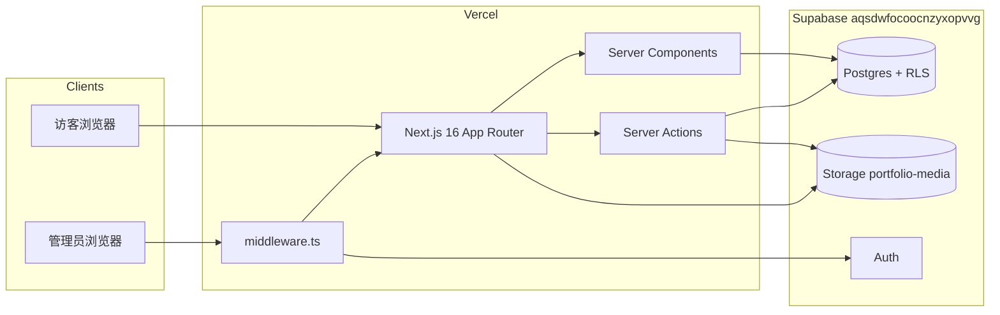

# 系统架构（qianna-website）

> **稳定架构说明**——技术栈、分层、数据流、横切能力。  
> 进度、本地环境、文件索引见 [`developer-guide.md`](developer-guide.md)；Agent 入口见 [`AGENTS.md`](../AGENTS.md)。

最后更新：2026-08-20

---

## 1. 系统上下文

个人作品集站点：**Next.js App Router** 渲染前台与 Admin CMS，**Supabase** 提供 Postgres、Auth、Storage。



| 项 | 值 |
|---|---|
| 生产 URL | https://www.qiannawang.com |
| 托管 | Vercel（`main` 自动部署） |
| 数据库 / Auth / 媒体 | Supabase Project `aqsdwfocoocnzyxopvvg` |
| 公开媒体 Bucket | `portfolio-media`（匿名可读） |

---

## 2. 技术栈

| 层 | 选型 |
|---|---|
| 框架 | Next.js **16.2.1**（App Router） |
| UI | React **19** + TypeScript |
| 样式 | Tailwind CSS **v4**（`app/globals.css`） |
| 后端即服务 | Supabase（`@supabase/ssr` + `@supabase/supabase-js`） |
| 图片处理 | `sharp`（迁移 / Admin 上传压缩） |
| 前台图片 | `next/image`（Hero 等，`fill` + `priority`） |
| 分析 | 自研 `page_views` 表 + Vercel Analytics / Speed Insights |
| 反垃圾 | Cloudflare Turnstile（Guestbook） |

---

## 3. 仓库分层

```
app/
  page.tsx, layout.tsx          # 前台布局、首页、全局 metadata
  <route>/page.tsx              # 各内容页（Server Component）
  _components/                  # 前台共享组件（Hero、Reveal、Guestbook…）
  _data/*.ts                    # 静态回退数据（无 Supabase 时 build 仍可通过）
  admin/**                      # CMS：表单、MediaManager、Server Actions
  auth/callback|confirm         # Supabase Auth 回调
  analytics/actions.ts          # 页面浏览上报
  sitemap.ts, robots.ts         # SEO

lib/
  <module>/queries.ts           # 读库 + isSupabaseConfigured() 回退
  supabase/                     # server / client / public-env
  seo/                          # metadata、canonical、sitemap 数据
  media/                        # Hero 压缩管线（compress-hero-image.ts）
  admin/, analytics/, guestbook/, notes/, projects/ …

supabase/migrations/            # 0001–0018 SQL（建表、RLS、GRANT）

scripts/                        # migrate-*、download-*、recompress-home-hero

middleware.ts                   # /admin 鉴权；首页 Auth 参数转发
```

**原则：** 页面薄、查询厚；Admin 写操作集中在 `"use server"` 的 actions 文件。

---

## 4. 请求与渲染

### 4.1 前台页面

1. **Server Component** 调用 `lib/*/queries.ts`
2. `isSupabaseConfigured()` 为 false，或查询失败 / 空 → 回退 `app/_data/*`
3. 需要交互的区块用 Client Component（如 `GuestbookSection`、`HeroImageDistortionClient`）

### 4.2 Admin

1. `middleware.ts` 校验 Supabase session；未登录 → `/admin/login`
2. 未配置 Supabase 环境变量时 middleware **放行**（本地 / CI build 友好）
3. 表单提交 → **Server Actions** → Postgres / Storage → `revalidatePath`

### 4.3 Next.js 16 注意点

- 动态路由 `params` / `searchParams` 可能是 **Promise** → 需 `await`
- `"use server"` 文件 **不可 re-export** 其他 server action
- `useSearchParams` 需外层 **Suspense**

（详见 [`AGENTS.md`](../AGENTS.md)）

---

## 5. 数据架构

### 5.1 Postgres 模块（迁移 0001–0018）

| 迁移 | 领域 |
|------|------|
| 0001–0004 | projects, photography, visual_works, field_notes |
| 0005–0006 | site_settings, site_navigation_items |
| 0007, 0016 | about_page_content, profile_image |
| 0008–0009 | projects preview copy |
| 0010–0011 | notes, notes i18n |
| 0012 | traces navigation |
| 0013–0014 | guestbook, email |
| 0015 | page_views (analytics) |
| 0017 | undergraduate portfolio |
| 0018 | hide xicaoshi project |

每张业务表：**RLS** + 对 `anon` / `authenticated` 的 **GRANT**（公开读、Admin 写）。

### 5.2 静态回退

```text
Supabase 可用且查询有数据 → DB
否则 → app/_data/*.ts（与线上一致的快照）
```

保证：`npm run build` 在无 `.env.local` 时仍成功；视觉与生产一致。

### 5.3 Storage

- Bucket：`portfolio-media`
- 路径约定：`site/home-hero.webp`、各模块 slug 目录等
- 上传：Admin Server Action → `sharp` 压缩（Hero 1920px WebP q75）→ upload → `getPublicUrl`
- 大视频（如 Field Notes gliding）：**仅存 Google Drive 外链**，不上传 Storage

---

## 6. CMS 模块模式（新功能模板）

每个内容模块统一四层：

```text
supabase/migrations/000X_*.sql     → 建表 + RLS + GRANT
app/_data/*.ts                     → 静态回退
lib/<module>/queries.ts            → 查库 + fallback
app/<module>/page.tsx              → Server Component
app/admin/<module>/**              → CRUD + MediaManager + Server Actions
scripts/migrate-<module>.mjs       → sharp → Storage → DB
scripts/download-*-media.ps1       → sparse-checkout 下补 public 文件
```

**Admin 约定：** 变更后 `revalidatePath`；封面走 Storage 公开 URL。

完成度 checklist：[`cms-migration-checklist.md`](cms-migration-checklist.md)

---

## 7. 横切能力

### 7.1 认证

- Supabase Auth（邮箱 + 密码）
- `middleware.ts` 保护 `/admin/*`
- `/auth/callback`、`/auth/confirm` 处理 magic link / 重置密码
- 生产 **Site URL** / **Redirect URLs** 须含 `https://www.qiannawang.com`（见 [`exec-vercel-domain-2026-08-11.md`](exec-vercel-domain-2026-08-11.md)）

### 7.2 SEO

- `lib/seo/constants.ts`：`getSiteUrl()` 生产固定 canonical 域名
- `lib/seo/metadata.ts`：页面 title / description / OG
- `app/_components/seo/JsonLd.tsx`：Person + WebSite 结构化数据
- `app/sitemap.ts`：动态 sitemap（DB + 静态路由）
- 经验：[`experience-seo-metadata.md`](experience-seo-metadata.md)

### 7.3 Analytics

- 前台：`PageViewTracker`（Client）→ Server Action → `page_views`
- 后台：`/admin/analytics` 聚合展示
- 路径规范化：`lib/analytics/paths.ts`

### 7.4 Guestbook

- 前台预览（首页 3 条）+ `/guestbook` 全量
- Turnstile 校验 → Server Action → `guestbook_messages`
- 后台审核 / 隐藏：[`experience-guestbook.md`](experience-guestbook.md)

### 7.5 首页 Hero 与动效（2026-08）

| 能力 | 实现 |
|------|------|
| Hero 图源 | CMS `site_settings` → Storage `site/home-hero.webp` |
| 加载性能 | `next/image` + Admin/`recompress:home` 压缩 (~400KB) |
| Ken Burns / 文字 stagger | `globals.css` + `page.tsx` |
| 区块滚入 | `Reveal.tsx`（IntersectionObserver，`prefers-reduced-motion`） |
| WebGL 涟漪 | `HERO_DISTORTION_ENABLED = false`（可配置关闭） |

详见 [`experience-homepage-motion.md`](experience-homepage-motion.md)、[`exec-homepage-motion-2026-08-17.md`](exec-homepage-motion-2026-08-17.md)

### 7.6 Projects 详情

- Layout 变体：thesis | xicaoshi | portfolio（flipbook）
- Portfolio：`PortfolioFlipBook` + `lib/projects/portfolio-flip-pages.ts`

---

## 8. 部署与环境

### 8.1 Vercel

- 连接 GitHub `24205345/qianna-website`，`main` 分支部署
- 环境变量（Production）至少：

```text
NEXT_PUBLIC_SUPABASE_URL
NEXT_PUBLIC_SUPABASE_ANON_KEY
NEXT_PUBLIC_SITE_URL=https://www.qiannawang.com
```

Guestbook Turnstile、Analytics 等见各 `experience-*.md`。

### 8.2 本地

- `.env.local` 从 `.env.local.example` 复制（勿提交）
- 迁移脚本用 `SUPABASE_ADMIN_EMAIL` / `SUPABASE_ADMIN_PASSWORD`（**非** service_role）

### 8.3 sparse-checkout

`public/` 大图默认不在 clone 中；迁移前需 `scripts/download-*-media.ps1`。见 [`developer-guide.md`](developer-guide.md) §4。

---

## 9. 相关文档

| 文档 | 用途 |
|------|------|
| [`developer-guide.md`](developer-guide.md) | 进度、路由速查、本地开发、坑表 |
| [`README.md`](README.md) | 文档索引 |
| [`cms-migration-checklist.md`](cms-migration-checklist.md) | 模块验证清单 |
| [`exec-*.md`](.) | 单次交付记录 |
| [`experience-*.md`](.) | 可复用模式 |
